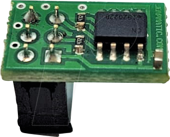
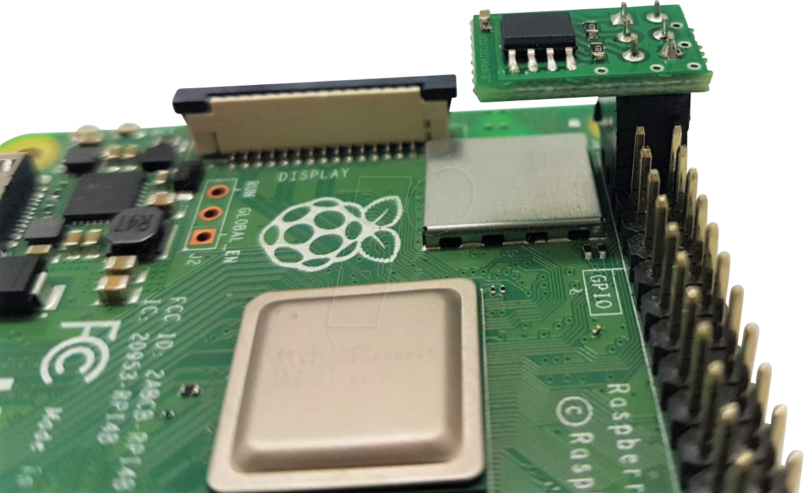
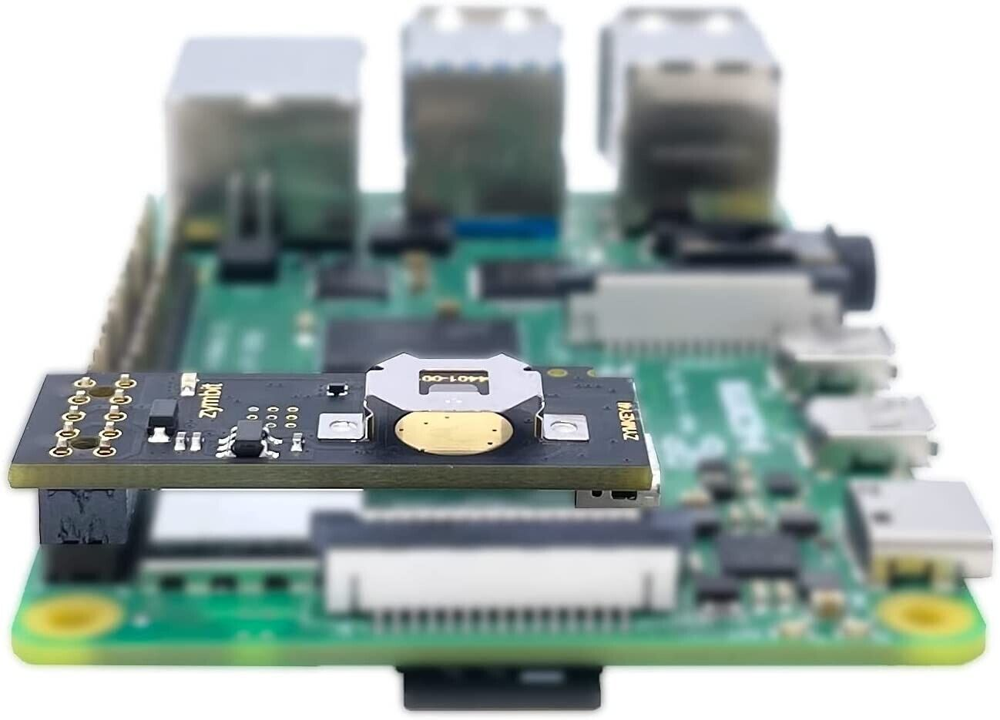

# Crypto Module for Raspberry Pi
## Overview

This Crypto Module, powered by LESI, integrates the ATECC608, a latest-generation crypto-authentication chip from Microchip, into a convenient PCB form factor. This allows for easy integration with Raspberry Pi and other compatible development boards, providing robust security features to protect your software and hardware from unauthorized access and tampering.

## Features

- **Secure Key Storage**: Stores private keys securely within the ATECC608 chip, preventing extraction.
- **Challenge-Response Authentication**: Supports cryptographic challenge-response queries for secure communication.
- **Elliptic Curve Cryptography (ECC)**: Implements ECDH for key exchange and ECDSA for digital signatures.
- **Hash Functions**: Supports SHA-256/HMAC for cryptographic operations and data integrity checks.
- **Random Number Generation**: Hardware support for generating high-quality random numbers.
- **Compatibility**: Works with 3.3V or 5V power/logic levels and interfaces via I2C, making it compatible with a range of development boards, including Raspberry Pi.

## Usage

Once installed and configured, the crypto module can be used for various security applications, including:

- **Network/IoT Node Protection**: Authenticates node IDs, ensures message integrity, and supports key agreements for encrypted communication.
- **Anti-Counterfeiting**: Validates the authenticity of removable or replaceable components.
- **Firmware Protection**: Validates and encrypts code stored in flash memory to prevent unauthorized modifications.
- **Secure Data Storage**: Stores secret keys for use by crypto accelerators in microprocessors.
- **Password Checking**: Validates user-entered passwords securely.

## Documentation

For detailed information, please refer to the following documents:

- [ATECC608 doc-1](https://cdn-reichelt.de/documents/datenblatt/A300/HATL01C-1.pdf)
- [ATECC608 doc-2](https://kickstartembedded.com/2022/03/25/raspberry-pi-atecc608-part-1-overcoming-modern-iot-security-challenges/)
- [ATECC608 doc-3](https://microchip.my.site.com/s/article/ATECC608---Software-library-and-examples)
- [ATECC608 doc-4 *](http://ww1.microchip.com/downloads/en/DeviceDoc/40001977A.pdf)
- [ATECC608 doc-5 (lib.python)](https://github.com/MicrochipTech/cryptoauthtools/tree/master/python)

    
    

##  ZymKey HSM :
features of the Zymkey HSM include:   

    * Cryptography engine 
    * 
    * Secure generation, storage, and management of cryptographic keys 
    * Physical Security:
        -   Tamper detection mechanisms like perimeter breach detection circuits, accelerometer for shock/orientation sensing, and power monitoring
        -   If physical tampering is detected, the Zymkey can initiate a self-destruction process, zeroizing or erasing all sensitive cryptographic keys and data

documents : 

  - [Zymkey 4](https://www.zymbit.com/zymkey/)
  - [Datasheet](https://www.zymbit.com/wp-content/uploads/2019/03/Zymbit-Datasheet_Secure-Compute-Device_04200910A3.pdf)
  
application example  :

  - [Zymkey HSM for SSH Authentication](https://techblog.dac.digital/zymkey-hsm-for-ssh-authentication-b28c7566b648)

    

