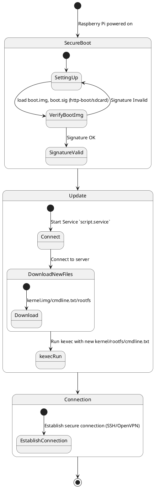

```plantuml
@startuml
state SecureBoot {
    [*] -->  SettingUp
    SettingUp --> VerifyBootImg: load boot.img, boot.sig (http-boot/sdcard)
    VerifyBootImg --> SignatureValid : Signature OK
    VerifyBootImg --> SettingUp : Signature Invalid
    
}

state Update {
    [*] --> Connect : Start Service `script.service`
    Connect -->  DownloadNewFiles: Connect to server
    DownloadNewFiles --> kexecRun : Run kexec with new kernel/rootfs/cmdline.txt
}

state DownloadNewFiles {
        [*] --> Download : kernel.img/cmdline.txt/rootfs
        
    }

state Connection {
    [*] --> EstablishConnection : Establish secure connection (SSH/OpenVPN)
}

[*] --> SecureBoot : Raspberry Pi powered on
SecureBoot  --> Update
Update --> Connection
Connection--> [*]
@enduml
```